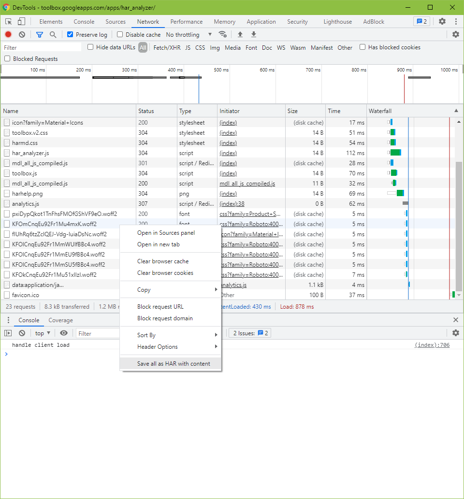

# How to Obtain a HAR Capture

Open Developer Tools and choose Network (`Ctrl+Shift+J`). Right mouse-click on the grid and choose "Save all as HAR with content."

## References

1. [How to get a HAR capture](https://toolbox.googleapps.com/apps/har_analyzer/)
