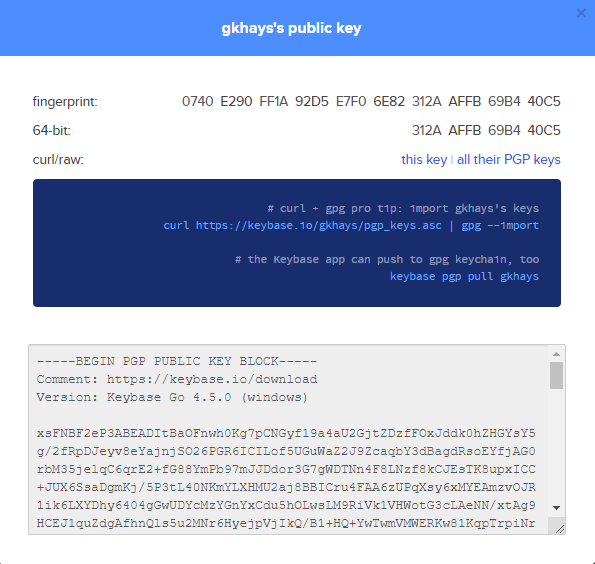

```
keybase.io/<username>
```

```
git config -l
core.symlinks=false
core.autocrlf=true
core.fscache=true
color.diff=auto
color.status=auto
color.branch=auto
color.interactive=true
help.format=html
rebase.autosquash=true
http.sslbackend=schannel
diff.astextplain.textconv=astextplain
filter.lfs.clean=git-lfs clean -- %f
filter.lfs.smudge=git-lfs smudge -- %f
filter.lfs.process=git-lfs filter-process
filter.lfs.required=true
credential.helper=manager
filter.lfs.clean=git-lfs clean -- %f
filter.lfs.smudge=git-lfs smudge -- %f
filter.lfs.process=git-lfs filter-process
filter.lfs.required=true
user.name=Garve Hays
user.email=gkhays@gmail.com
user.signingkey=Xxx
credential.helper=wincred
core.editor=vim
```



## References

1. [Set up Keybase.io, GPG & Git to sign commits on GitHub](https://github.com/pstadler/keybase-gpg-github)
1. [Github GPG + Keybase PGP](https://ahmadnassri.com/blog/github-gpg-keybase-pgp/)
1. [Importing pgp keys from keybase into gpg](https://www.elliotblackburn.com/importing-pgp-keys-from-keybase-into-gpg/)
1. [Signing git commits using Keybase](https://meedamian.com/post/keybase-signed-github/#git)
1. [Signing commits](https://docs.github.com/en/github/authenticating-to-github/signing-commits)
1. [Associating an email with your GPG key](https://help.github.com/en/github/authenticating-to-github/associating-an-email-with-your-gpg-key)
1. [Getting Verified badge next to your GitHub commits in VS Code](https://evotec.xyz/getting-verified-badge-next-to-your-github-commits-in-vs-code/)
