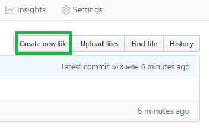
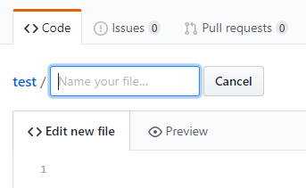
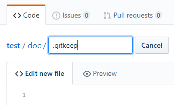
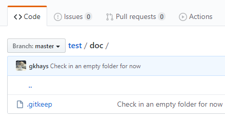
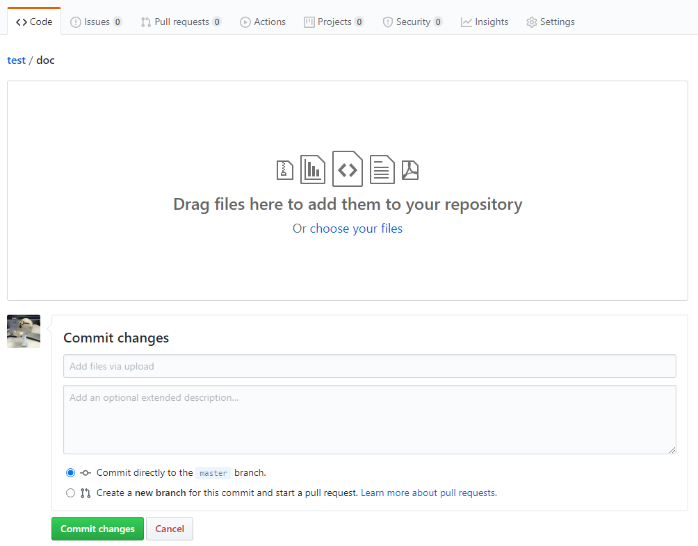

# Create Empty Folder with Online Editor

GitHub features a capable editor and online features that allow lots of flexibility. A handy one for me is the ability to create an empty directory. This can be leveraged for later updates. A frequently used pattern is to create a folder to contain images.

Use the GitHub create new file button.

As expected, you may give it a name.

However, if you input a path separator, e.g. `/`, it will allow you to create a subfolder! But Git will not allow you to check in an empty folder so we can use the `.gitkeep` convention to reserve a placeholder.

Now the empty folder is in place and available for later updates.

Perhaps using the GitHub upload files feature.

