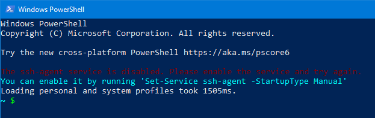

# GitHub CLI

First attempted to build from source but it wouldn't recognize the binary.

```go
go version
git clone https://github.com/cli/cli.git gh-cli
cd gh-cli
make
```

I didn't have `make` installed so I used `scoop` to install it.

```pwsh
scoop search make
scoop install make
Get-Command make
```

Still no dice. But since I now had [Scoop](../powershell/scoop.md), I just used it to install `gh-cli`. Also included [confcfg](https://github.com/lukesampson/concfg) for console settings and [pshazz](https://github.com/lukesampson/pshazz) for a nice Git prompt.

```pwsh
scoop bucket add github-gh https://github.com/cli/scoop-gh.git
scoop install gh
scoop install concfg
scoop install pshazz
```

A side effect of installing `pshazz` is that I now get a message about the SSH agent being disabled.



Since I already use SSH Agent from GitHub for Windows, I can live with it being disabled.

```bat
call "%GIT_INSTALL_ROOT%/cmd/start-ssh-agent.cmd" /k exit
:: call "C:\Program Files\OpenSSH\ssh-agent.exe"
call "%GIT_INSTALL_ROOT%/usr/bin/ssh-add" %HOME%/.ssh/id_rsa
```

## References

1. [GitHub’s official command line tool](https://github.com/cli/cli)
1. [Import / export Windows console settings](https://github.com/lukesampson/concfg)
1. [Give your powershell some pizazz](https://github.com/lukesampson/pshazz)
1. [A PowerShell environment for Git](https://github.com/dahlbyk/posh-git)
1. [unable to start ssh-agent service, error :1058](https://github.com/lukesampson/pshazz/issues/70)
