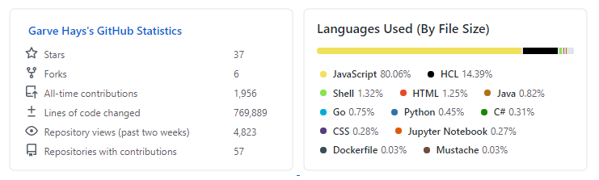

# GitHub Statistics in Your README



This is a 2-for-1! The GitHub special README and how to add statistics to it. Create a new repo with the same name as your GitHub username. In my case: `gkhays/gkhays`.

```


```

Here is the whole thing.

```
### Hi there 👋

<div align="center">

[](https://github.com/gkhays/)
[]()

</div>

<!--
**gkhays/gkhays** is a ✨ _special_ ✨ repository because its `README.md` (this file) appears on your GitHub profile.

Here are some ideas to get you started:

- 🔭 I’m currently working on ...
- 🌱 I’m currently learning ...
- 👯 I’m looking to collaborate on ...
- 🤔 I’m looking for help with ...
- 💬 Ask me about ...
- 📫 How to reach me: ...
- 😄 Pronouns: ...
- ⚡ Fun fact: ...
-->
```

## References

1. [Including Your GitHub Statistics in Your GitHub ReadMe.md File](https://www.jasongaylord.com/blog/2020/10/28/implementing-github-readme-statistics)
1. [GitHub Stats Visualization](https://github.com/jstrieb/github-stats)
1. [How to Use Github's README Feature to Track Your Stats in One Click](https://hackernoon.com/how-to-use-githubs-readme-feature-to-track-your-stats-in-one-click-l1293ulv)
1. [GitHub Profile README Generator](https://github.com/rahuldkjain/github-profile-readme-generator?ref=hackernoon.com)
1. [Rahul's Profile](https://github.com/rahuldkjain)
1. [Dynamically Generated Github Stats For Your Profile ReadMe](https://dev.to/anuraghazra/dynamically-generated-github-stats-for-your-profile-readme-o4g)
1. [GitHub README Stats](https://github.com/anuraghazra/github-readme-stats)
1. [GitHub Special Repository, The Public Profile Readme](https://kevsoft.net/2020/07/04/github-special-repository-the-public-profile-readme.html)
