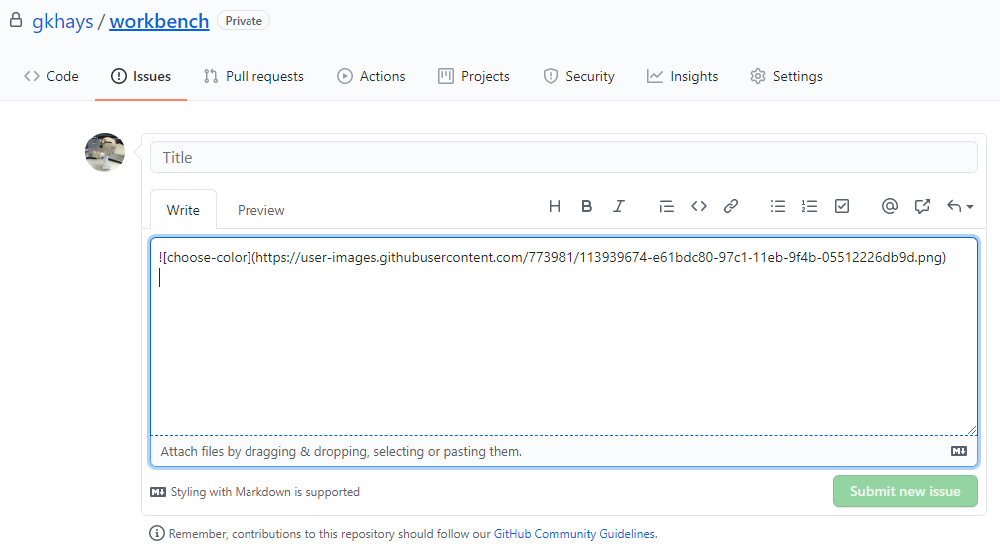

# Add an Image to a Wiki

I knew how to add images to a gist by uploading them into comments. Futhermore, I can add images to a GitHub repo wiki by cloning the wiki locally. But it turns out there is a web-only solution too!

The trick is to create a new issue, we do not intend to save, and drag and drop an image into the issue body. It will be uploaded to GitHub's user content.

Once it has resolved you can copy the string and insert it into the wiki. No need to create the issue -- just discard it.

## References

1. [How to: Add images to the Wiki](https://github.com/RWTH-EBC/AixLib/wiki/How-to:-Add-images-to-the-Wiki)

### Honorable Mention

[How To Add Images To A GitHub Wiki](https://mikehadlow.blogspot.com/2014/03/how-to-add-images-to-github-wiki.html) (Blogger.com)  
[How To Add Images To A GitHub Wiki](https://dzone.com/articles/how-add-images-github-wiki) (DZone)
