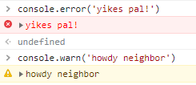

# Set JavaScript Console Log Level

The console supports log levels, such as `warn` and `error`.

```console
console.warn('Add a little emphasis to this message')
```



## References

[Fireship | how to never write bug](https://youtu.be/X3jw1JVNdPE)
