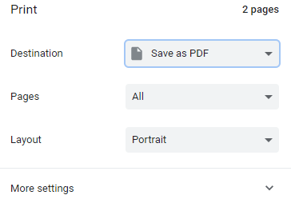

# Export Wiki as PDF Document

Click on the ellipses in the upper, right hand corner and select `Open in SharePoint`.


Within SharePoint, navigate to `Site contents` then `Teams Wiki Data`. Locate the folder for the channel and click on it. The wiki pages are stored as `MHT` (web archive) files. Select the one you are intested in by clicking on the radio button. Include any images. Choose `Download` from the options bar.


Once the file is downloaded, edit it and remove the `MIME` header and save it as an `HTML` document.

```
MIME-Version: 1.0
Content-Transfer-Encoding: quoted-printable
Content-Type: text/html; charset="utf-8"
```

Now you may view the file in your browser and use the print to PDF function available in most browsers. E.g.



## References

[Microsoft Teams Wiki Export](https://www.lance.bio/2018/09/06/microsoft-teams-wiki-export/)
