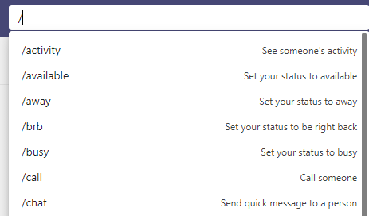

# Navigate to the Search or Command Entry Box and Enter a Command

Use `Ctrl + /` or `Cmd + /` to navigate to the search or command entry box and enter a command. Type `/` or `@` for a list of commands. a few that I have used recently:

- `/activity`
- `/files`
- `/save`

