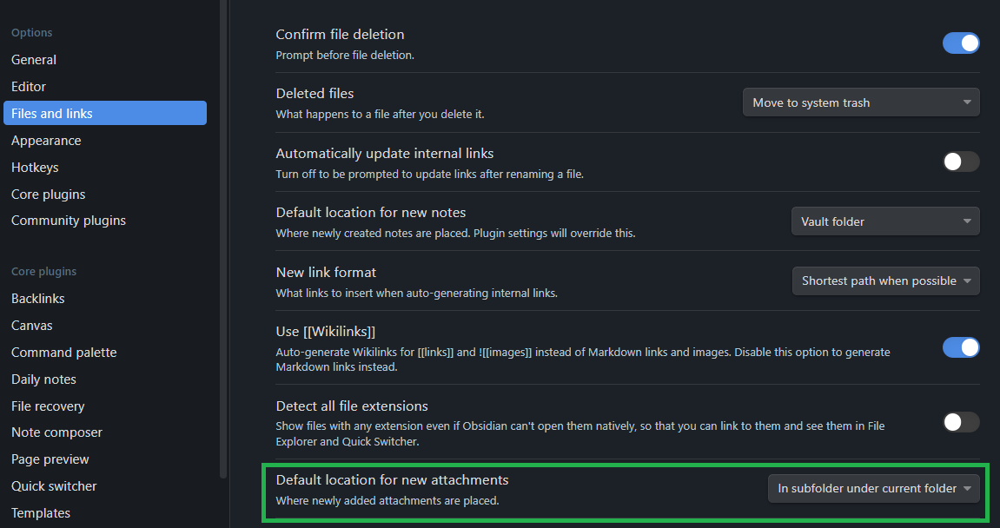

# Change Location of Images

`Settings > Files & Links > Default location for new attachments`.

Example

## References
[How to specify the default the location for images?](https://forum.obsidian.md/t/how-to-specify-the-default-the-location-for-images/32254)
