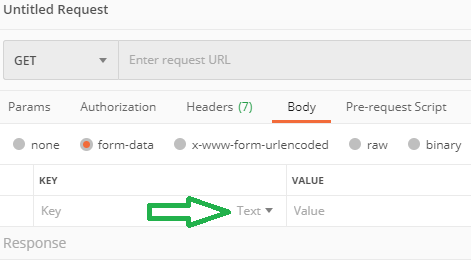
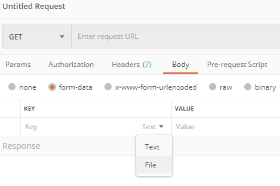
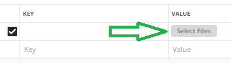

# Load Payload from File

I had a more than 2-page JSON file that I wanted to use as a payload. For shorter JSON documents, pasting it in is usually not a problem but in this case it would be great if Postman supports files. Turns out it does!

In the `Body` section, choose the `form-data` radio button. Just before the value column, there is a drop-down list.

From it select `File`.

The `Select Files` button will appear.

## References

1. [How to upload a file and JSON data in Postman?](https://stackoverflow.com/a/39037889/6146580)
1. [Working with data files](https://learning.postman.com/docs/postman/collection-runs/working-with-data-files/)
