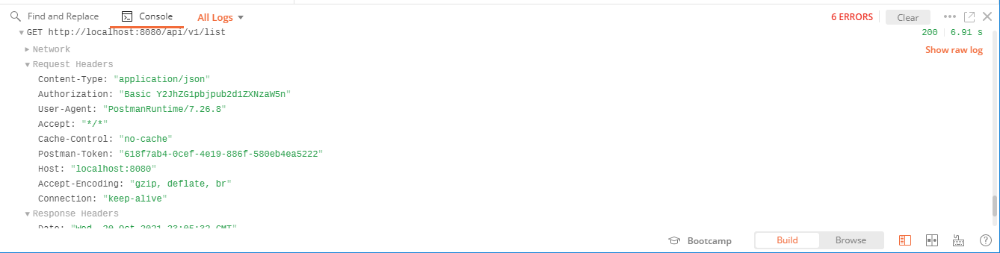

# Show Request Headers

Request headers may be viewed in the Postman console.

## References

1. [Postman - How to see request with headers and body data with variables substituted](https://stackoverflow.com/a/47278422/6146580)
