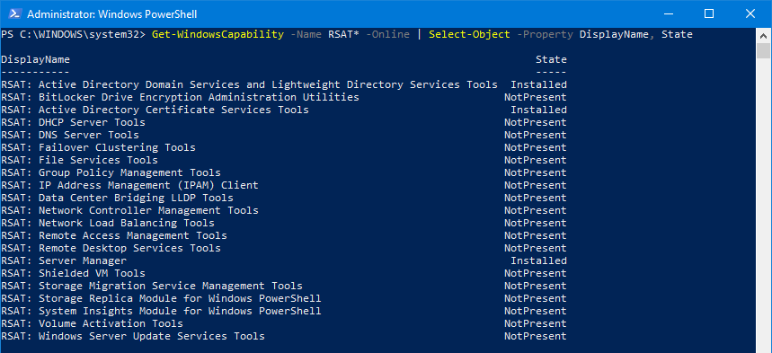

# Get Windows Capability

```powershell
Get-WindowsCapability -Name RSAT* -Online | Select-Object -Property DisplayName, State
```



```powershell
PS C:\WINDOWS\system32> Get-WindowsCapability -Name RSAT* -Online | Select-Object -Property DisplayName, State
DisplayName                                                                          State
-----------                                                                          -----
RSAT: Active Directory Domain Services and Lightweight Directory Services Tools  Installed
RSAT: BitLocker Drive Encryption Administration Utilities                       NotPresent
RSAT: Active Directory Certificate Services Tools                                Installed
RSAT: DHCP Server Tools                                                         NotPresent
RSAT: DNS Server Tools                                                          NotPresent
RSAT: Failover Clustering Tools                                                 NotPresent
RSAT: File Services Tools                                                       NotPresent
RSAT: Group Policy Management Tools                                             NotPresent
RSAT: IP Address Management (IPAM) Client                                       NotPresent
RSAT: Data Center Bridging LLDP Tools                                           NotPresent
RSAT: Network Controller Management Tools                                       NotPresent
RSAT: Network Load Balancing Tools                                              NotPresent
RSAT: Remote Access Management Tools                                            NotPresent
RSAT: Remote Desktop Services Tools                                             NotPresent
RSAT: Server Manager                                                             Installed
RSAT: Shielded VM Tools                                                         NotPresent
RSAT: Storage Migration Service Management Tools                                NotPresent
RSAT: Storage Replica Module for Windows PowerShell                             NotPresent
RSAT: System Insights Module for Windows PowerShell                             NotPresent
RSAT: Volume Activation Tools                                                   NotPresent
RSAT: Windows Server Update Services Tools                                      NotPresent
```

## References

1. [Use PowerShell to Install the Remote Server Administration Tools (RSAT) on Windows 10 version 1809](https://mikefrobbins.com/2018/10/03/use-powershell-to-install-the-remote-server-administration-tools-rsat-on-windows-10-version-1809/)
1. [Install RSAT Feature On Demand On Windows 10 1809 Using PowerShell](https://zamarax.com/2019/01/03/install-rsat-feature-on-demand-on-windows-10-1809-using-powershell/)
1. [How to Install RSAT in Windows 10 (3 Methods)](https://www.itechguides.com/rsat-windows-10/)
