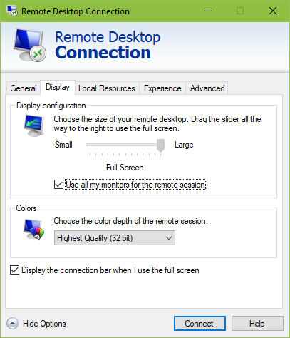
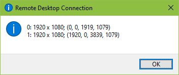

# Multiple Monitors with Remote Desktop Session



List monitors.

```console
mstsc /l
```



Adjust `selectedmonitors`.

```console
full address:s:x.x.x.x:3389
prompt for credentials:i:1
administrative session:i:1
screen mode id:i:2
span monitors:i:1
use multimon:i:1
selectedmonitors:s:0,1
```

## References

1. [Using Multiple Monitors in Remote Desktop Session](https://techcommunity.microsoft.com/t5/security-compliance-and-identity/using-multiple-monitors-in-remote-desktop-session/ba-p/246840)
1. [How to remote desktop fullscreen RDP with just SOME of your multiple monitors](https://www.hanselman.com/blog/how-to-remote-desktop-fullscreen-rdp-with-just-some-of-your-multiple-monitors)
