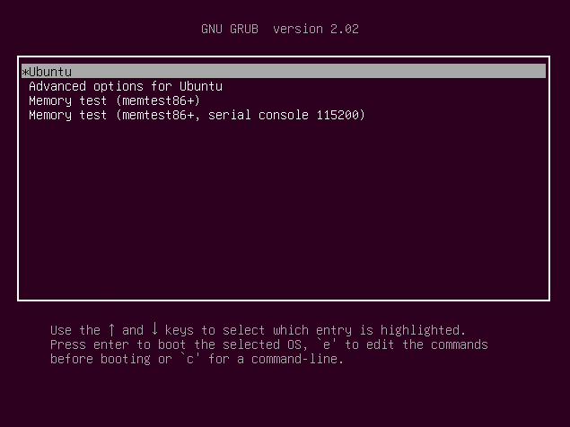
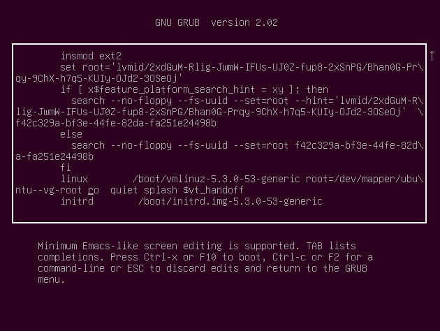

# Recover Root Password on Ubuntu 18.04

Boot into the GRUB menu. Right after the BIOS menu click on `Left Shift` or `Esc`.



Click on `e` to edit and scroll down to the line containing:



Change it from:

```
ro      quiet splash $vt_handoff
```

Change it to:

```
rw      init=/bin/bash
```

Then hit `F10`. Thereafter;

```
mount | grep -w /
passwd
passwd <username> # *optional*

exec /sbin/init
```

## References

1. [How to reset lost root password on Ubuntu 18.04 Bionic Beaver Linux](https://linuxconfig.org/how-to-reset-lost-root-password-on-ubuntu-18-04-bionic-beaver-linux)
1. [How do I reset a lost administrative password?](https://askubuntu.com/questions/24006/how-do-i-reset-a-lost-administrative-password)
