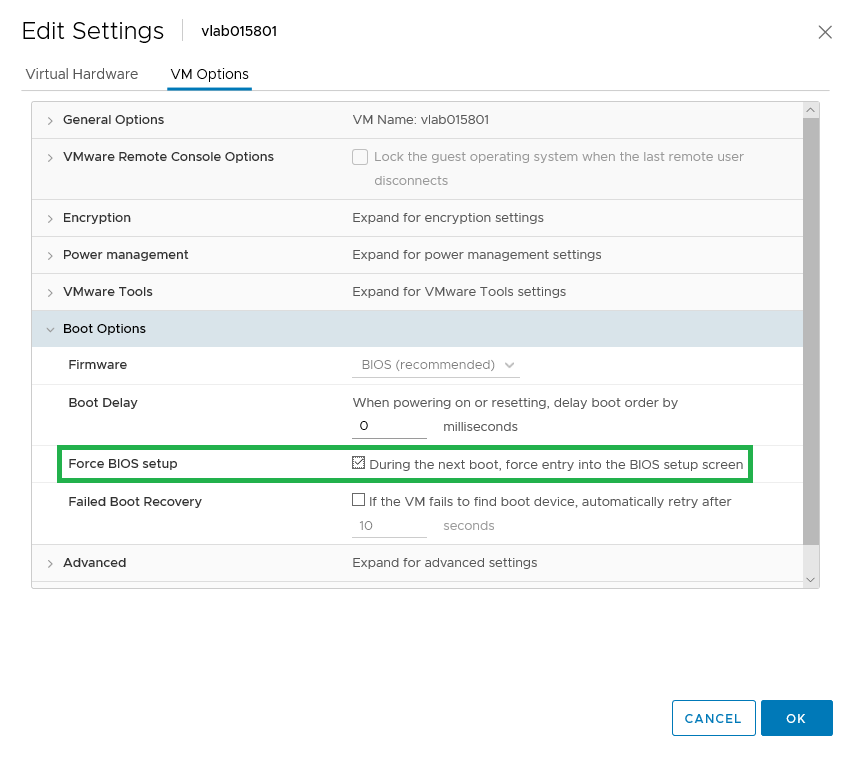

# Force BIOS Setup

In the vSphere web client navigate to `Edit Settings...` and then click on the `VM Options` tab. Open the `Boot Options` section and click on the check box to the right of `Force BIOS setup`.

