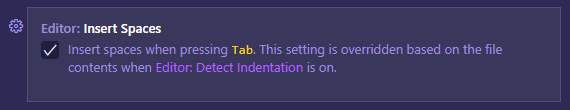
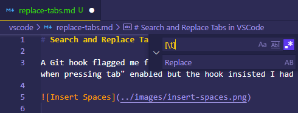

# Search and Replace Tabs in VSCode

A Git hook flagged me for having tabs in a source file. I have "insert spaces when pressing tab" enabled but the hook insisted I had tabs!

Find with regular expessions `Ctrl + F` or `Ctrl + H` then click on `.*`

## References

[How can I convert tabs to spaces and vice versa in an existing file](https://stackoverflow.com/a/51735845/6146580)
