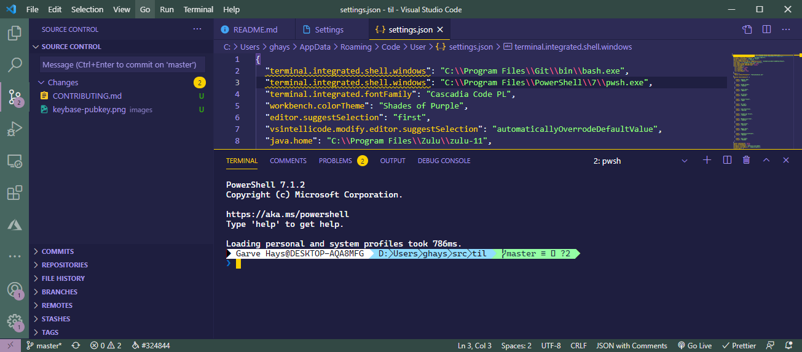

# Change VSCode Terminal Font

```json
“terminal.integrated.fontFamily”: “Cascadia Code PL”,
```



## References

1. [How to change font for terminal in Visual Studio Code?](https://medium.com/@youngstone89/how-to-change-font-for-terminal-in-visual-studio-code-c3305fe6d4c2)
