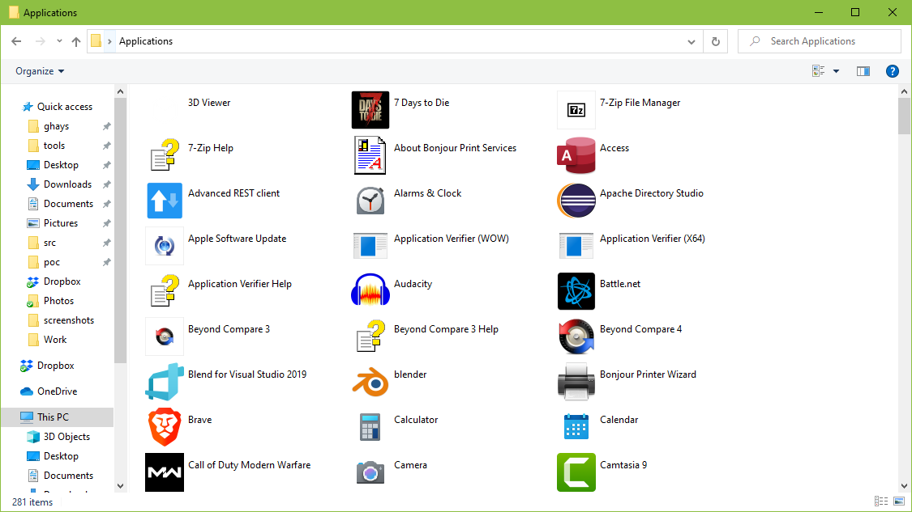

# Applications Virtual Folder Shortcut

Click in the Explorer address bar and type

```command
shell:AppsFolder
```



Right mouse-click and drag to the desktop.


## References

1. [What is that `Applications` folder in Windows 10 and how to get rid of it?](https://superuser.com/a/1471748/1100004)
