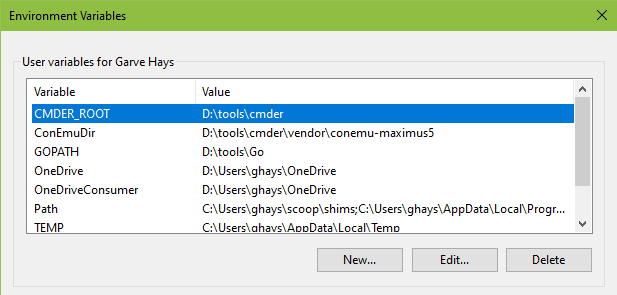

# Add Cmder to Windows Terminal



```json
{
  "guid": "{2530ce78-f85c-41c4-9f71-9eb0cb3a7e09}",
  "name": "Cmder",
  "commandline": "cmd.exe /k %CMDER_ROOT%\\vendor\\init.bat",
  "startingDirectory": "%USERPROFILE%",
  "icon": "%CMDER_ROOT%\\icons\\cmder.ico",
  "background": "#2e3436",
  "padding": "15",
  "fontFace": "Cascadia Code",
  "fontSize": 10
}
```

## References

1. [Windows Terminal + Cmder = ❤️](https://medium.com/talpor/windows-terminal-cmder-%EF%B8%8F-573e6890d143)
1. [Windows Terminal Themes](https://windowsterminalthemes.dev/)
