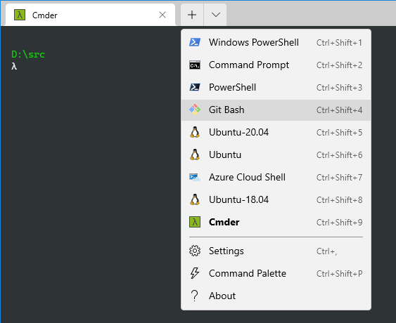

# Add Git Bash to Windows Terminal



Open settings with `Ctrl + ,` and add the following to the profiles array (`[]`).

```json
{
  "guid": "{bc4f4084-dc69-4aa4-bab5-7d2bd07578a0}",
  "hidden": false,
  "name": "Git Bash",
  "commandline": "%PROGRAMFILES%\\Git\\bin\\bash.exe --login -i",
  "icon": "%PROGRAMFILES%\\Git\\mingw64\\share\\git\\git-for-windows.ico",
  "startingDirectory": "%HOMEDRIVE%%HOMEPATH%",
  "tabTitle": "Git Bash"
}
```

**Note**: The Git for Windows installation program adds the option to add a Git Bash profile to Windows Terminal.

## References

1. [Add Git-Bash to the new Windows Terminal](https://www.belter.io/add-git-bash-to-windows-terminal/)
1. [Adding Git-Bash to the new Windows Terminal](https://stackoverflow.com/a/57369284/6146580)
1. [How to add Git Bash to Windows Terminal Application](https://executecommands.com/add-git-bash-to-windows-terminal-app-profile/)
