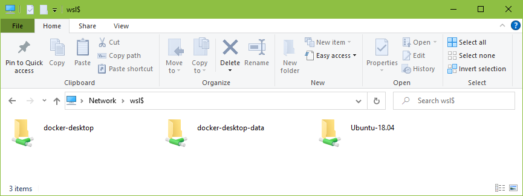

# Map WSL Disk as Network Drive

Enter the following UNC path in Windows Explorer:

```
\\wsl$
```



## References

1. [Browse Windows Subsystem for Linux files with Windows Explorer](https://gunnarpeipman.com/browse-wsl-with-explorer/)
