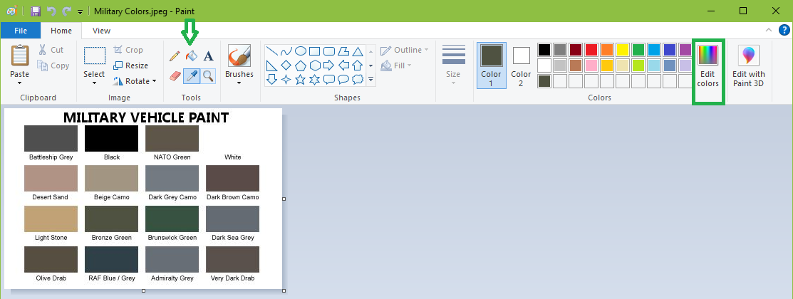
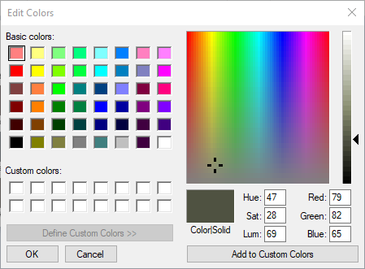

# Look Up RGB Codes with Microsoft Paint

Open an image containing the color you wish to decompose. Then select the eye-dropper tool and click on the color sample.

Now click on Edit colors. The resulting dialog will highlight the target color and reveal the RGB codes in addition to hugh, saturation, and luminosity

