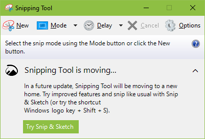

# Using Windows 10 Snip & Sketch

Launch Snip & Sketch with the following keyboard shortcut.

`Windows logo key + Shift + S`

Also available from the Action Center.

`Windows logo key + A`

## References

1. [Use Snipping Tool to capture screenshots](https://support.microsoft.com/en-us/windows/use-snipping-tool-to-capture-screenshots-00246869-1843-655f-f220-97299b865f6b)
1. [Snip­ping Tool vs Snip & Sketch: How Do They Differ](https://www.guidingtech.com/snipping-tool-vs-snip-sketch-difference/)
