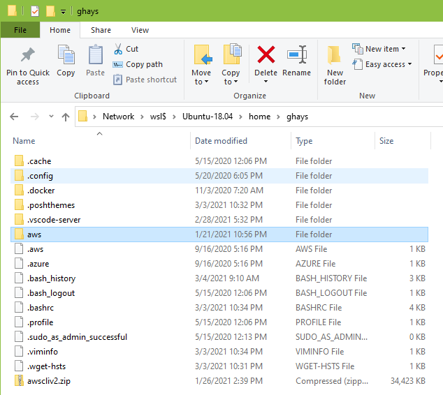

# Browse WSL Files from Windows Explorer

In WSL 2, files may be reached at the UNC path `\\wsl$\<distro>\`, e.g.

```
\\wsl$\Ubuntu-18.04\
```

You may determine the name of your distribution as follows.

```
$ wsl -l -v
  NAME                   STATE           VERSION
* Ubuntu-18.04           Running         2
  openSUSE-Leap-15-1     Stopped         2
  kali-linux             Stopped         2
  docker-desktop         Running         2
  docker-desktop-data    Running         2
  Ubuntu                 Stopped         1
  openSUSE-42            Stopped         1
```

In Windows Explorer.


